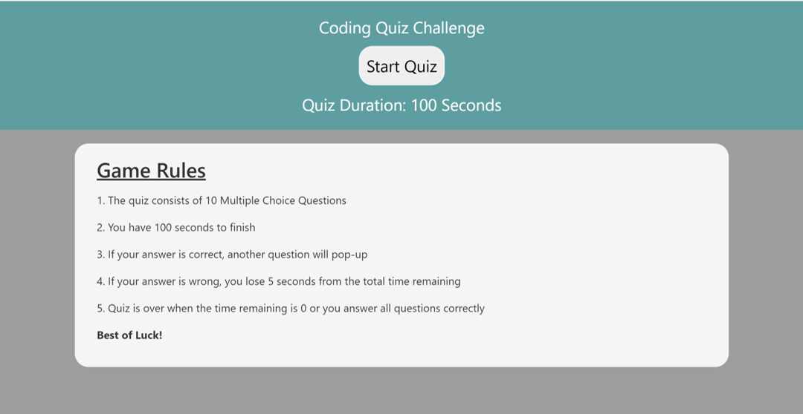
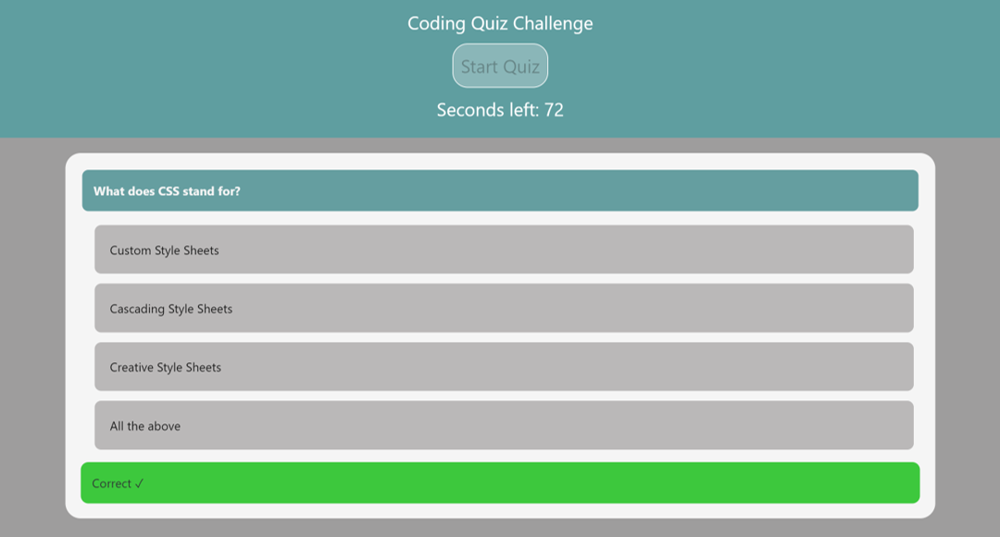
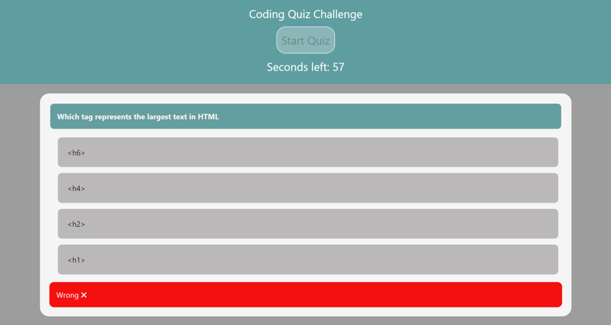
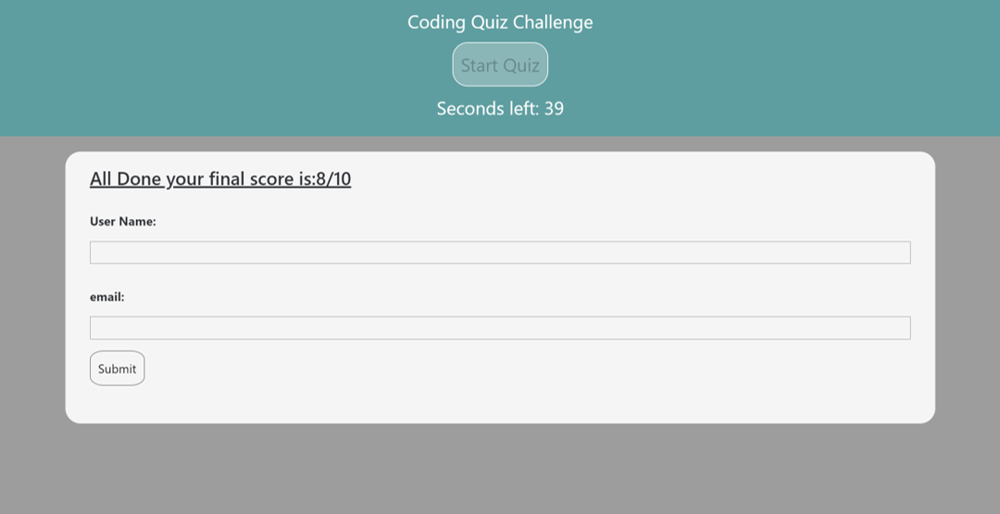
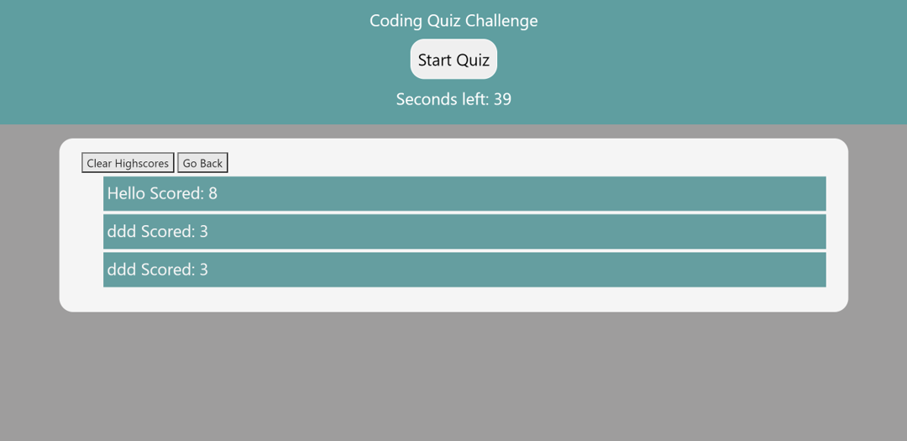

# Code-Quiz-Application
This code quiz application is an exciting quick implementation for a quiz example that has multiple choices per question.

The applicaiton can be accessed through: [Code Quiz](https://nohaashraf85.github.io/Code-Quiz-Application/)

## Technologies Used:
* HTML 
* CSS
* Bootstrap
* javascript

## Rules:
1. The quiz consists of 10 Multiple Choice Questions
2. You have 100 seconds to finish
3. If your answer is correct, another question will appeare
4. If your answer is wrong, you lose 5 seconds from the total time remaining
5. Quiz is over when the time remaining is 0 or you answer all questions correctly

## How it Works:
1. Accessing the application the user is presented with the homepage that includes the set of rules for taking the quiz

2. Upon clicking on Start Quiz button, you are presented with a multiple choice question type quiz, if you answer correctly, a correct sign will appeare

3. Ifi you answer wrong, a wrong sign will appeare and 5 seconds will be deducted from the time remaining then a new question will be presented

4. If you answer all questions correctly or the times reaches 0 the quiz ends
5. Upon finishing, a screen will appeare to show the score and asks the user to enter credentials

6. After entering credentials, the user is presented with a highscore board
7. This page supports two buttons, either to clear the highscores or to go back and take the quiz again

8. If the user chooses to take the quiz again, the user will be returned to the homepage and the quiz will run automatically where the start quiz button will be disabled and the counter will start running

